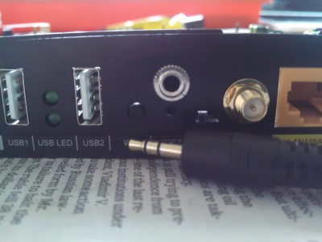
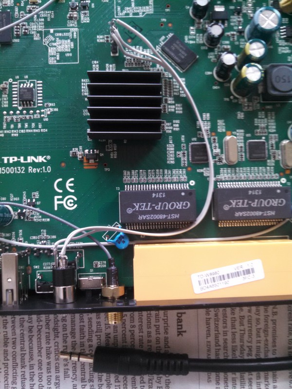

This section primary concerns the TP-Link TD-W8980, but it will probably be useful to users who have the [TD-W9980](http://wiki.openwrt.org/toh/tp-link/td-w9980) and possibly also the [TD-W8970](http://wiki.openwrt.org/toh/tp-link/td-w8970).

# Preflight

It is *strongly* recommended you have a serial console (see below) working.

You will need a TFTP client.

Plug in your workstation over Ethernet, and assign yourself a static IP in the range `192.168.1.{2...254}/24`.

## Debian

    sudo apt-get install --no-install-recommends -yy tftp

# Building

Work through [Configuration](../../../README.md#configuration) and then type the following to build the firmware:

    make ath79/td-w8980

# Installing

...

# Information

Here is some helpful information regarding the device.

## Opening the Unit

## Serial Cable

The serial port mod I use is to place a standard stereo 3.5mm headphone jack onto the back of the unit immediately above the reset switch.  You will want to measure up about ~12.5mm from the centre of the reset switch to where you are to bore your hole for the socket.

The process is made easier by that [FTDI](http://ftdichip.com/) make very nice serial cables that work great under Linux, including the [TTL-232R-3V3-AJ](http://www.ftdichip.com/Products/Cables/USBTTLSerial.htm) which means you do not need to mess with a MAX-232 chip or soldering.  For the cabling inside I used some spare [ribbon cable](http://en.wikipedia.org/wiki/Ribbon_cable).

Wiring it up is straight forward by using the [headphone jack pinout of the TTL-232R-3V3-AJ](http://www.ftdichip.com/Images/TTL-232R-AJ%20pinout.jpg) with the pinout of the router below:

      Towards Front of the Linksys TD-W8980
    ^^^^^^^^^^^^^^^^^^^^^^^^^^^^^^^^^^^^^^^^
     __
    |  |    <- Pin 4, Router's Serial TX
     --
    |  |    <- Pin 3, Router's Serial RX
     --
    |  |    <- Pin 2, GND
     --
    |  |    <- Pin 1, VCC [not used for serial port]
     --
     J7
    
    ---------------\
                   |
       CPU/SoC     |
    
    vvvvvvvvvvvvvvvvvvvvvvvvvvvvvvvvvvvvvvvv
      Towards Rear of the Linksys TD-W8980

**N.B.** remember that when wiring you attach the TX pin of one end to the RX pin of the other and of course GND to GND

Once all hooked up, you should use [minicom](http://alioth.debian.org/projects/minicom/) and configure the serial port to run at `115200 8N1` with *no* hardware or software flow control.

**N.B.** press `t` on the console to interrupt U-Boot autobooting

## JTAG

The JTAG 'port' can be found to the left of the CPU/SoC where you will find six labelled surface mount pads, although on my unit they were actually solder blobs.

### Resurrecting a Brick

...

## Kernel Cooking Notes

A list of issues and hints I have found with the kernel:

 * ...

# Related Links

 * [OpenWrt TP-Link TD-W8980](http://wiki.openwrt.org/toh/tp-link/td-w8980)
