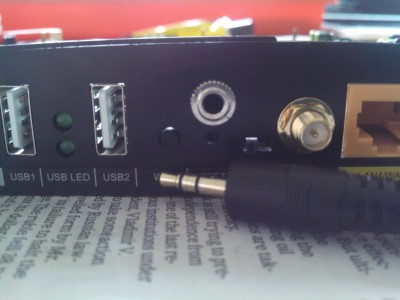
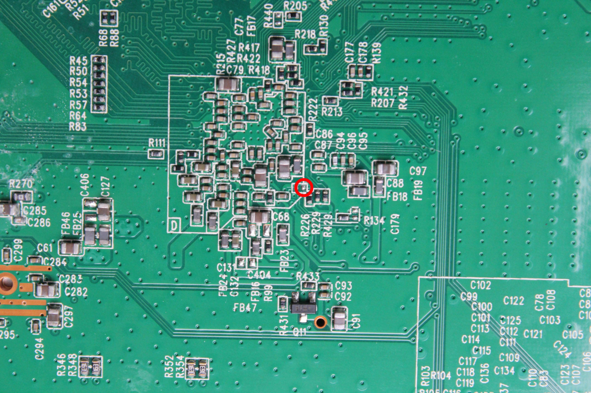
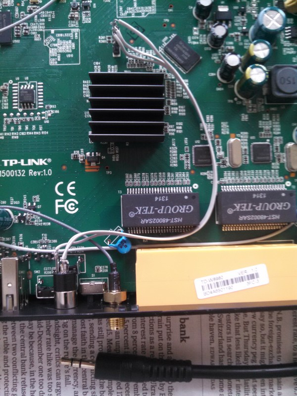

This page applies to the TP-Link TD-W8980, however it will probably be of use to users who have the [TD-W9980](http://wiki.openwrt.org/toh/tp-link/td-w9980) and possibly also the [TD-W8970](http://wiki.openwrt.org/toh/tp-link/td-w8970).

# Preflight

You will need:
 * the serial console (see below) working
 * an TFTP server (Debian users can type `sudo apt-get install --no-install-recommends -yy tftp`)
 * your workstation plugged in via Ethernet, and assigned with the static IP `192.168.1.100/24` (if you want to change this, you will need to run `setenv` for `ipaddr` and `serverip`)

# Building

Work through [Configuration](../../../README.md#configuration) and then type the following to build the firmware:

    make lantiq/td-w8980

# Installing

You will need to copy `bratwurst.image` to your TFTP server directory (typically `/srv/tftp`).  Then from the serial console type:

    tftp $(loadaddr) bratwurst.image
    sf erase 0x20000 0x7a0000
    sf write $(loadaddr) 0x20000 0x$(filesize)
    reset

The router should now boot into BRatWuRsT.

# Information

Here is some helpful information regarding the device.

## Opening the Unit

There are four screws underneath the unit that need to be removed, and then you need to use a thin flat screw driver to pop the clips that fortunately give way easily without snapping.

In total there are nine clips, three on the left, three on the right, two on the front and one (hard to see in the above photo) at the centre rear.

The board is not fixed to the chassis, and can just be easily lifted out (and put back in) by carefully lifting the front and sliding out; take not of the structs that the screws went into that keep the board in place.

## Serial Cable

The serial port mod I use is to place a standard stereo 3.5mm headphone jack onto the back of the unit immediately above the reset switch.  You will want to measure up about 15mm from the centre of the reset switch to where you are to bore your hole for the socket.

The process is made easier by that [FTDI](http://ftdichip.com/) make very nice serial cables that work great under Linux, including the [TTL-232R-3V3-AJ](http://www.ftdichip.com/Products/Cables/USBTTLSerial.htm) which means you do not need to mess with a MAX-232 chip or soldering.  For the cabling inside I used some spare [ribbon cable](http://en.wikipedia.org/wiki/Ribbon_cable).

Wiring it up is straight forward by using the [headphone jack pinout of the TTL-232R-3V3-AJ](http://www.ftdichip.com/Images/TTL-232R-AJ%20pinout.jpg) with the pinout of the router below:

                Towards Front
    ^^^^^^^^^^^^^^^^^^^^^^^^^^^^^^^^^^^^^^^^
     __
    |  |    <- Pin 4, Router's Serial TX
     --
    |  |    <- Pin 3, Router's Serial RX
     --
    |  |    <- Pin 2, GND
     --
    |  |    <- Pin 1, VCC [not used for serial port]
     --
     J7
    
    ---------------\
                   |
       CPU/SoC     |
    
    vvvvvvvvvvvvvvvvvvvvvvvvvvvvvvvvvvvvvvvv
                Towards Rear

**N.B.** remember that when wiring you attach the TX pin of one end to the RX pin of the other and of course GND to GND

Once all hooked up, you should use [minicom](http://alioth.debian.org/projects/minicom/) and configure the serial port to run at `115200 8N1` with *no* hardware or software flow control.

**N.B.** press `t` on the console to interrupt U-Boot autobooting

## Resurrecting a Brick

TODO, how to build a suitable image!

By far the easiest, and the only approach I have used, is to put the unit into its "boot from serial" and send a suitable image (typically u-boot) over the serial port that it then boots and you can recover from.

This is done by shorting the right side of `R225` to `GND` (for example to the shield on your serial port); I recommend using a length of un-used solder flex as it is soft and will not damage the pads through repeated use.

If you are successful you will see on the serial port:

    ROM VER: 1.1.4
    CFG 04
    EEPROM Data OK
    UART

**N.B.** you *must* keep the short in place for the duration of the upload, whilst you use the u-boot image, and during the *whole* reflashing process where you are debricking!  Only once you have reflashed your router, you can disconnect the short.

You can use one of these two methods to upload your image:

 - if you are using `minicom`, you can `type Ctrl-A Y` and select the image to 'upload', it will begin to type the image for you
 - open another terminal and send the image directly to the serial port with

        cat u-boot.asc > /dev/ttyUSB0

You can tell this is working as a row of stars will start to show on the screen; if instead you the contents of the image appearing on screen, your short of `R225` to `GND` is still not in place, you need to keep the short in place for the duration of the upload

**N.B.** if you instead get 'corruption' appearing on your console or nothing seems to happen, then you should recheck that your soldering of the serial port is good

### SPI Banging with a SOIC Clip

Alternatively, if you have something that can talk SPI directly, for example a Raspberry Pi or a [Bus Pirate SPI](http://dangerousprototypes.com/docs/Bus_Pirate), then you can buy cheaply a [SOIC clip](http://www.amazon.com/Signstek-SOIC8-Socket-Adpter-Programmer/dp/B00V9QNAC4/) and reflash the flash directly.

The process is described on the OpenWRT forum post titled [de-bricking Tp-Link td-w8970 with flashrom and soic clip](https://forum.openwrt.org/viewtopic.php?pid=279395).

## JTAG

**N.B.** as the flash is on an SPI bus, it is far harder to to debrick your unit in this manner than with the other methods

The JTAG 'port' can be found to the left of the CPU/SoC where you will find six labelled surface mount pads, although on my unit they were actually solder blobs.

## Kernel Cooking Notes

A list of issues and hints I have found with the kernel:

 * ...

# Related Links

 * [OpenWrt TP-Link TD-W8980](http://wiki.openwrt.org/toh/tp-link/td-w8980)
